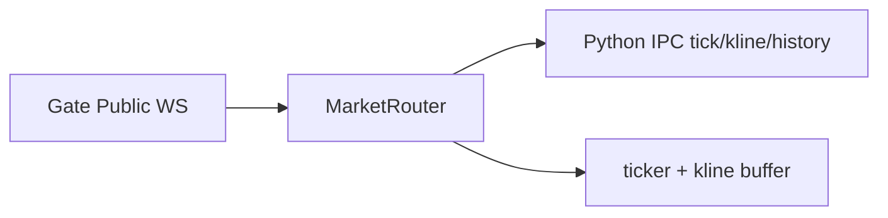
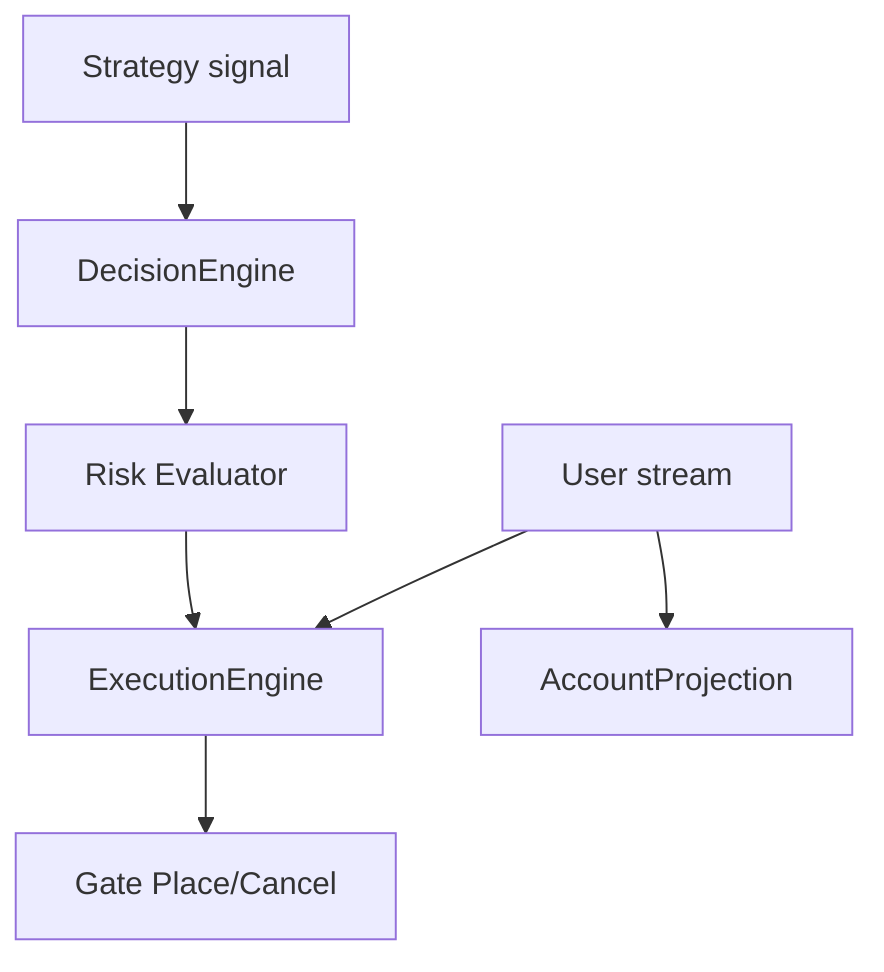
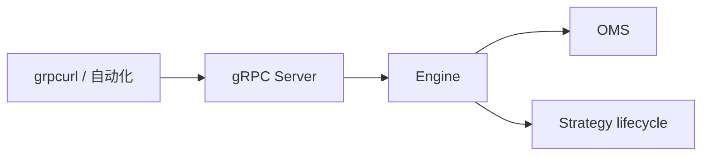

# Signalix 技术架构

| 属性 | 说明 |
|------|------|
| 文档类型 | 技术架构说明 |
| 状态 | **描述当前实现**；网关与部分风控为后续演进 |
| 引擎↔外部 | **gRPC**（可选）；策略↔引擎 **stdin/stdout JSON** |
| 关联文档 | [产品设计](./PRODUCT_DESIGN.md) |

---

## 1. 架构目标与原则

### 1.1 目标

- **单机强编排**：在一个 Go 进程内完成行情接入、策略运行时、风控、决策、OMS、对账。
- **策略不可信**：Python 子进程慢、崩溃、乱发消息时，引擎有限流、超时、背压与资源上限。
- **交易所可替换**：领域语义不绑定 Gate 原始字段；Gate 为一期 **adapter** 实现。
- **可恢复与可观测**：重启后能接续；`trace_id` 贯穿 tick → signal → order → exchange。
- **无 UI、无引擎内 HTTP**：人机与 REST 由独立 **网关**（后续）提供；引擎对外 **gRPC** 可选启用。

### 1.2 设计原则

1. **依赖方向**：`domain` 不依赖 IO；`app` 依赖 `ports`；`adapters` 实现 `ports`。
2. **单写者**：订单可写状态仅在 **OMS** 内修改。
3. **CQRS 轻量**：写路径（启停、下单、撤单）与读路径（投影、RPC 查询）区分超时策略。
4. **Fail-safe**：订单路径禁止静默丢弃；行情 tick 可配置降级。
5. **网关不维护第二套 OMS**（网关实现后仍适用）。

---

## 2. 逻辑分层

```
┌─────────────────────────────────────────────────────────────────┐
│  cmd/signalixd                                                   │
│  配置加载、依赖组装、Engine 生命周期、可选 gRPC Server              │
└───────────────────────────────┬─────────────────────────────────┘
                                │
        ┌───────────────────────┼───────────────────────┐
        ▼                       ▼                       ▼
┌───────────────┐       ┌───────────────┐       ┌───────────────┐
│  internal/app │       │  internal/    │       │  internal/    │
│  engine, oms, │──────►│  ports        │◄──────│  adapters     │
│  market, ...  │       │               │       │  gateio,      │
└───────┬───────┘       └───────────────┘       │  pythonipc,   │
        │                                       │  sqlite, grpc │
        ▼                                       └───────────────┘
┌───────────────┐
│  domain/risk  │  纯规则：Evaluate、Verdict
└───────────────┘
```

| 层级 | 路径 | 职责 |
|------|------|------|
| **Domain** | `internal/domain` | 风控等纯函数与值对象 |
| **Application** | `internal/app` | Engine 编排、pipeline、goroutine 所有权 |
| **Ports** | `internal/ports` | `Exchange`、`StrategyRuntime`、`OrderStore`、`RiskEvaluator` |
| **Adapters** | `internal/adapters` | Gate.io、Python IPC、SQLite、gRPC |
| **Exchange 模型** | `pkg/exchange/perp` | 永续 DTO 与 `perp.Live`；Gate 实现在 `gateio` 子包 |

---

## 3. 目录结构（当前）

```
cmd/signalixd/
internal/
  app/
    engine/           # 编排、IPC RPC、策略生命周期
    market/           # MarketRouter：订阅、ticker/K 线缓存与分发
    strategy/         # Catalog 加载
    decision/         # Signal → Order
    oms/              # ExecutionEngine（单写者 OMS）
    projection/       # AccountProjection
  domain/risk/
  ports/
  adapters/
    exchange/gateio/
    strategy/pythonipc/
    store/sqlite/
    grpc/
api/
  proto/              # signalix.engine.v1
  gen/go/             # buf generate 输出
sdk/python/           # 策略 SDK
```

---

## 4. 核心子系统

### 4.1 Market Router

- 公共 WS → 归一化 → 按策略订阅表 fan-out
- 缓存 ticker；K 线环形缓冲供 `get_klines` RPC
- REST 预热历史 K 线 → IPC `history` + 灌缓冲
- **不负责**下单

### 4.2 Strategy Runtime

- `pythonipc`：进程、`SendInit` / `SendTick` / `SendKline` / `SendHistory`、stdout 读循环
- Python SDK：Reader + Worker 双线程，支持 `on_kline` 内同步 RPC
- 心跳监控；崩溃计数与 **可配置自动重启**（`[strategies.restart]`，见 EH-1）

### 4.3 Risk Evaluator

- `dispatchSignal` 中 Decision 之后、OMS 之前
- `internal/domain/risk.Evaluate` + `StaticRiskEvaluator`
- 已实现：单笔上限、最大挂单数、最大持仓合约数、锁仓、日亏、回撤、杠杆、单合约名义上限

### 4.4 Decision Service

- `ProcessSignal`：结合 AccountProjection 将 Signal 转为 Order
- 不直接调用所 API

### 4.5 OMS（ExecutionEngine）

- 单写者：Submit、Cancel、user stream 更新、重试
- 启动时 `HydrateFromSnapshot` + 对账

### 4.6 AccountProjection

- 定时 REST 全量 + 私有 WS 增量（持仓、余额）
- 读者：Decision、Risk、策略 RPC `get_balance` / `get_position`

### 4.7 Persistence

- SQLite：`$SIGNALIX_WORK_DIR/data/signalix.db`
- 未完成订单、策略 `set_state`
- 启动：`loadSnapshotAndReconcile` → projection → 启策略

---

## 5. 数据流

### 5.1 行情路径



### 5.2 交易路径



### 5.3 控制面（gRPC，可选）



已实现 RPC 见 `api/proto/signalix/engine/v1/engine.proto`（Ping、策略启停、订单查询与事件流等）。

### 5.4 启动顺序（当前）

1. 加载配置；连接交易所
2. `loadSnapshotAndReconcile`（若启用 SQLite）
3. `AccountProjection.Start`
4. `ExecutionEngine.Start`（user stream）
5. Engine dispatch goroutines；MarketRouter 订阅
6. 加载并 `StartStrategy` 各 enabled 策略
7. 可选：gRPC Server 监听

关停顺序相反：停策略 → 刷盘 → 停 OMS / projection → 断所。

---

## 6. gRPC 契约

- **包名**：`signalix.engine.v1`
- **生成**：`make proto`（Buf → `api/gen/go`）
- **安全**：默认 `127.0.0.1`；可选 static token；`insecure_bind_all` 仅开发使用
- **metadata**：`x-request-id`
- **Emergency**：`ActivateKillSwitch` / `DeactivateKillSwitch` / `GetKillSwitchStatus`（EH-3；内存态，重启后默认 OFF）
- **未实现 / 推迟**：行情只读 RPC、Unix socket

---

## 7. 并发模型

| 组件 | 模型 |
|------|------|
| MarketRouter | 单分发；per-strategy 发送 |
| Strategy IPC | 每策略：读消息、stderr、心跳各 goroutine |
| Signal / Order dispatch | 各单 goroutine + channel |
| OMS | 单写者 loop |
| AccountProjection | 单 refresh loop + RLock 快照 |
| gRPC handler | 转 Engine 方法；订单写入经 OMS 队列 |

---

## 8. 错误处理

- Adapter 映射所侧错误为稳定语义
- 投影未就绪：RPC / 决策返回明确错误
- OMS / 主 channel 满：Warn 日志（Fail-safe 可观测）

---

## 9. 已知限制与后续演进

| 主题 | 当前状态 | 方向 |
|------|----------|------|
| 策略自动重启 | 已实现 | `[strategies.restart]`：backoff + 滑动窗口熔断 |
| 风控扩展字段 | 已实现（EH-2/EH-3） | 策略级限额（EH-4） |
| Kill Switch | 已实现 | 不持久化；拒开仓、允 Flat/撤单 |
| `get_market` RPC | 未实现 | 读 tickerCache |
| HTTP 网关 | 无 | 独立服务，REST → gRPC |
| 合约元数据 | 无缓存 | 下单前校验 |
| REST rate_limit | 配置占位 | adapter 层限流 |

---

## 10. 测试

- `go test ./...` — domain、engine、oms、projection、adapters 等包
- gRPC 冒烟：`grpcurl` Ping（见 README）
- 策略 SDK：本地 unittest（开发者目录，未随仓库公开）

---

## 11. 文档维护

- 行为变更时同步更新本节与 [PRODUCT_DESIGN.md](./PRODUCT_DESIGN.md) 状态表。
- Proto 变更后运行 `make proto` 并更新 README 示例。

**文档版本**：v0.2  
**最后更新**：开源整理；反映 `internal/app` 当前布局
